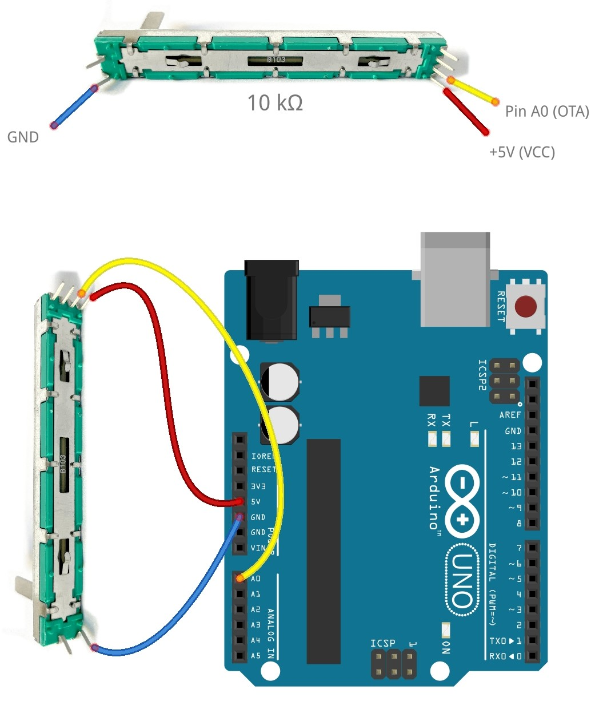
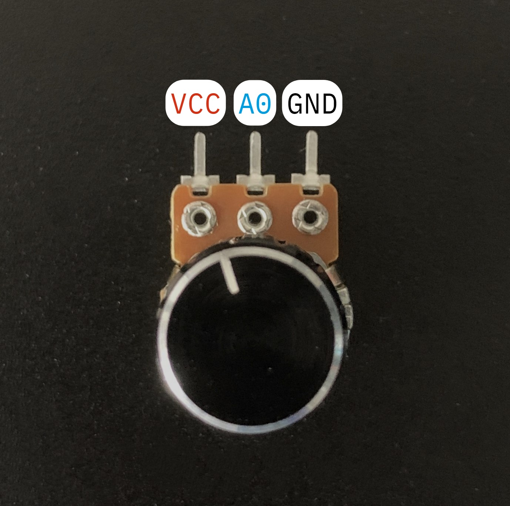
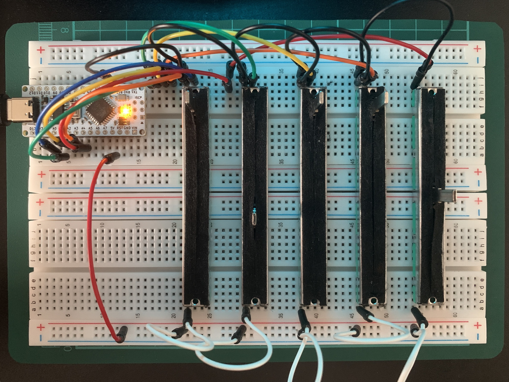

# Audio Mixer

The Audio Mixer is an open source project built around the **ATMega328p** with a lightweight driver for Windows. You can design and build your own audio mixer using potentiometers to seamlessly control the volume of your desktop applications.

## Introduction

This project should work on devices using the **ATMega328p MCU**, this includes the **Arduino Nano/Uno** boards and similar AVR devices like the ATMega168p.

### Hardware

The materials required:

- Compatible microcontroller.
- Potentiomenters (Fader recommended).
- Wire.
- Breadboard (Optional but recommended).

**Example Schematic**

The image shows how to wire up a fader/slider resistor to an Arduino UNO, though it would be the same for the NANO. Some sliders will clearly label the VCC, GND, and Output pins. When wiring up multiple sliders, use the subsequent analog channels such as A1, A2, A3...



Alternatively, if you are using single turn potentiometers the pinout is provided below:



Here is an assembled breadboard prototype with 5 sliders all connected to the **Arduino NANO**, which is then connected to the computer using a USB-C cable.



### Software

**Basic Functionality**

- The microcontroller is programmed using bare metal C, and is transmitting JSON strings over the Serial Communication Interface.
- The desktop application provided acts as an audio driver, it will deserialize the JSON strings and adjust the volumes of assigned applications based on the values received.

**Desktop Application**

- Allows the user to see all active audio sessions.
- Easily modify the configuration file.
- Change the settings of the Serial Port.


## Configuration File

The following is the configuration JSON file that is stored in the same directory as the audio driver application. The user can directly modify the file or use the GUI.

```json
{
  "BaudRate": 9600,
  "COMPort": "COM4",
  "Applications": ["*", "-", "chrome", "Discord", "Spotify"]
}
```

### Wildcards

Wildcards are used to assign multiple applications to the same slider.

- `*` Master Volume Control.
- `-` Controls all applications that are not assigned to a slider.
- `!` Current Active Window/Fullscreen Window.

To assign specific applications to a slider, you can type in the process name directly instead. (Seen in the "Detected Sessions" list).

## Running the Application

The download for the audio driver can be found in the **[Releases](https://github.com/Bowhza/Audio-Mixer/releases/)** section. Though you can complie the application yourself from the source code (`.NET Framework 4.8.1` is required) found [here](https://github.com/Bowhza/Audio-Mixer/tree/main/Audio-Driver).

### Flashing the Code

To flash the code to the microcontroller, the Platform-IO IDE [extension](https://marketplace.visualstudio.com/items?itemName=platformio.platformio-ide) is required for VSCode.

Once the extenstion is installed and your microcontroller is connected to your computer follow the steps below:

1. Click on the Platform-IO Icon on the sidebar. Followed by the "`Pick a folder`" button to open the project folder.


2. Navigate to where the project folder is downloaded, make sure that it is exctracted from the zip file.


3. Select the folder and press `Select Folder` in the bottom right corner.

4. With the folder open, press `Ctrl + Shift + B` to open the command pallette and select `PlatformIO: Build`.


5. If the project has built successfully, you will see a clear message in the terminal. You can continue to the next step.

6. Press `Ctrl + ALT + U` to upload the code to the microcontroller. Below is an image it the process completed successfully.


7. The code is now flashed to the device, and you can run the provided executable.

## To-Do List

Things that can be improved, added or fixed:

- [x] Add functionality for the `!` wildcard.
- [x] Add auto config creation if one does not exist.
- [ ] Fix bug where audio sessions do not refresh.
- [ ] Improve code to account for noise.
- [ ] Add support for SSD1306 OLED to various information on the mixer.
- [ ] Add support for linux.
- [ ] Much More...
